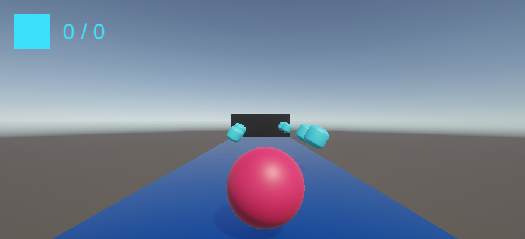

# RollTheBall

A simple 3D ball rolling game project made with Unity.

## Project Overview

- **RollTheBall** is a game where the player controls a ball and navigates it to the goal.
- Built using Unity's physics engine and input system.

## Folder Structure

- `Assets/` : Game assets (scripts, scenes, prefabs, etc.)
- `Packages/` : Package information used in the project
- `ProjectSettings/` : Project settings files

## How to Run

1. Add this folder as a project in Unity Hub.
2. Open the project in the Unity Editor and run the main scene located in `Assets/Scenes`.

## Development Environment

- Unity Version: **6000.0.49f1**
- Main Packages:
  - com.unity.ai.navigation
  - com.unity.collab-proxy
  - com.unity.ide.rider
  - com.unity.ide.visualstudio
  - com.unity.inputsystem
  - com.unity.multiplayer.center
  - com.unity.render-pipelines.universal
  - com.unity.test-framework
  - com.unity.timeline
  - com.unity.ugui
  - com.unity.visualscripting
  - (plus various Unity modules)

## Notes

- Folders like `Temp`, `Library`, etc. are not included in version control.
- See the `.gitignore` file for details. 